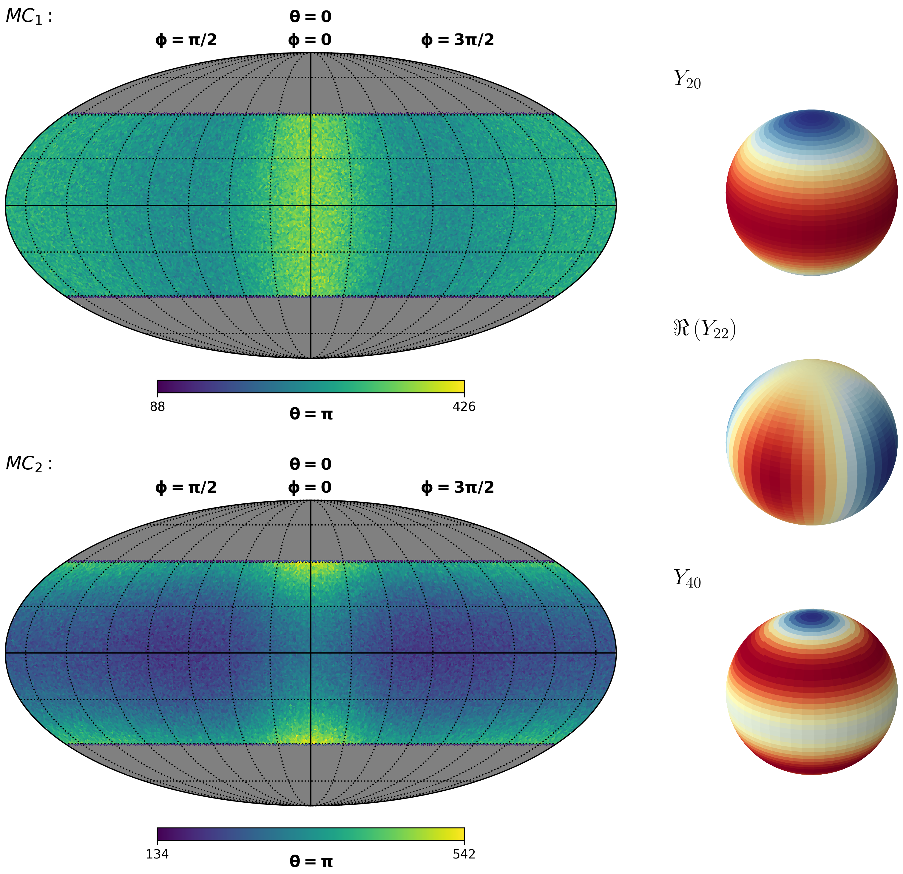

# powspechi

A simple python library for angular power spectral analysis of heavy-ion data - coupled to [HEALPix](https://healpix.sourceforge.io/). Explore the combination of methods used to analyze the early universe with debris from the matter created in accelerators. In other words, [quark-gluon plasma](https://home.cern/science/physics/heavy-ions-and-quark-gluon-plasma) meets spherical harmonics.

Below it is possible to see examples of maps created from simulated particle distributions as well as some of the spherical harmonics that contribute to their geometries. One can also see the final spectra extracted from [ALICE public data from Run 1](http://opendata.cern.ch/record/1106) and the [mALICE](https://github.com/cbourjau/alice-rs/) repository. The spectra are shown for the 10-20% most central events at different ranges of transverse momentum (p<sub>T<\sub>). Figures taken from ["Geometry in heavy ions: estimating an angular power spectrum"](https://www.nbi.ku.dk/english/research/phd_theses/phd_theses_2019/meera_vieira_machado/meera.pdf).




Anyone simply interested in performing an angular power spectral analysis of heavy-ion collisions is welcome to use **powspechi**. Feel free to test your 3+1D theoretical models, to test on the Run 2 data of LHC, or to just have fun creating your own spharical maps and spectra! Any questions, just contact me at machado.meera@protonmail.com.

### Prerequisites 

In order to run **powspechi**, the HEALPix-based python package [healpy](https://healpy.readthedocs.io/en/latest/index.html) should be installed. Preferably healpy >= 1.12.10, which can be installed as follows:

**Conda**
 
```
conda config --add channels conda-forge
conda install healpy
```

**Pip**

```
pip install --user healpy
```

### Installing

### Documentation

### Tutorial

A Jupyter notebook tutorial along with some example files can be downloaded [here](https://github.com/m33ra/powspechi/raw/master/tutorial.zip); be warned that it is around 200 MB due to the example files. Alternatively, the tutorial can be visualized with Jupyter nbviewer [here](https://nbviewer.jupyter.org/github/m33ra/powspechi/blob/future/tutorial/Tutorial.ipynb). 

### Publications

* [Angular power spectrum of heavy ion collisions](https://journals.aps.org/prc/abstract/10.1103/PhysRevC.99.054910)
* [Heavy ion anisotropies: a closer look at the angular power spectrum](https://arxiv.org/abs/1907.00413)
